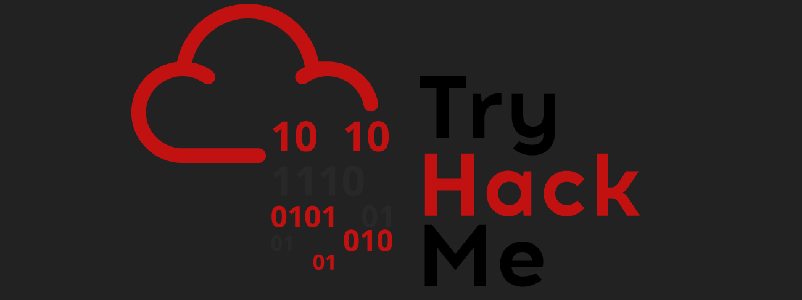

<h1 align="center">Hi 👋, I'm Sharo</h1>
 <!-- Added more spacing -->
<h2 align="center">Code, Secure, Build: Junior Python Developer, Cyber Security Analyst, and Web Development Enthusiast</h2>
   <!-- Added more spacing -->

- 🔭 Actively contributing to **cybersecurity challenges on platforms like Hack The Box. Currently immersed in a penetration testing project aimed at improving my ethical hacking skills.**

- 🌱 I’m currently learning **advanced Python concepts, mastering cybersecurity techniques, and exploring the vast world of web development.**

- 👯 Seeking collaborators for **cybersecurity projects! Whether it's penetration testing, threat analysis, or securing applications, I'm eager to join forces and learn together.**

- 🤝 I’m looking for help with **optimizing Python code for efficiency and seeking guidance on advanced cybersecurity concepts. Any tips or insights are greatly appreciated!**

- 💬 Ask me about **pythonic wonders, cybersecurity practices, or share your web development challenges with me!**

- 📫 How to reach me: **sharodubey1312@gmail.com**

- 🌐 Connect with me on [TryHackMe](https://tryhackme.com/p/Sharo11)

- 📄 Know about my experiences [Portfolio Link](https://portfolio-sharo.vercel.app/)

- ⚡ Fun fact: **I am an anime freak 😎**

<h3 align="left">Connect with me:</h3>

 
   <!-- Added more spacing -->
    
  
   <!-- Added more spacing -->
    
  

<h3 align="left">Languages and Tools:</h3>

  <!-- Added more spacing between icons -->
  
    
    
    
    
    
    
    
    
    
    
    

&nbsp;

